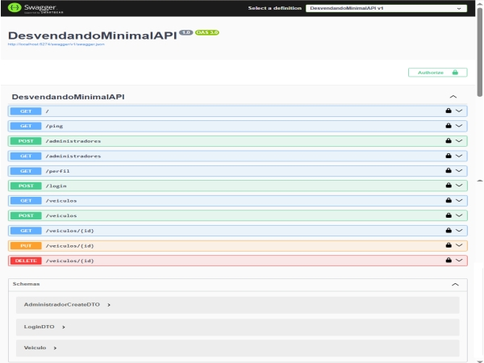

# Desvendando Minimal API

Este projeto tem como objetivo explorar os conceitos de Minimal API no .NET 8, implementando autenticação JWT, controle de acesso por perfil e operações CRUD para veículos, seguindo a estrutura proposta no bootcamp Avanade.

*Minimal API* é uma abordagem introduzida no .NET 6 que permite criar APIs de forma mais simples, direta e enxuta, reduzindo a quantidade de arquivos e abstrações necessárias, tornando o desenvolvimento mais rápido e acessível.

Ao invés de usar controllers, atributos e rotas complexas, em minimal-api se define os endpoints diretamente no Program.cs, com funções inline que respondem às requisições HTTP.

## Diferença entre Minimal API e ASP.NET Core tradicional
A principal diferença está na estrutura e na forma como os endpoints são definidos.

### ASP.NET Core (MVC)

- É preciso criar controllers, definir rotas com atributos como [Route] e [HttpGet], configurar tudo em um arquivo Startup.cs, e seguir uma arquitetura mais robusta e orientada a camadas. 

- Ideal para aplicações grandes e complexas, como sistemas web completos com interface gráfica.

### Minimal API

- Pode começar com apenas um arquivo Program.cs, definir seus endpoints com MapGet, MapPost, MapPut, etc., e configurar os serviços diretamente com builder.Services. Isso torna o projeto mais leve, mais rápido de iniciar e mais fácil de entender, especialmente para fins de estudo.

## Exemplo comparativo

Na Minimal API, um endpoint pode ser definido assim:

csharp

app.MapGet("/hello", () => "Olá, mundo!");

Enquanto no modelo tradicional, seria necessário criar um controller:

csharp

[Route("api/[controller]")]

public class HelloController : ControllerBase

{

    [HttpGet]

    public IActionResult Get() => Ok("Olá, mundo!");

}

-------------------------------------------------

## Estrutura de pastas

- `Domain/`: entidades como `Administrador` e `Veiculo`

- `DTOs/`: objetos de transferência como `LoginDTO` e `AdministradorCreateDTO`

- `Services/`: serviços como `TokenService`

- `Repositories/`: acesso a dados, como `AdministradorRepository`

- `Endpoints/`: definição dos endpoints (`VeiculoEndpoints`, etc.)

- `Context/`: configuração do banco de dados (`AppDbContext`)

## Configuração do JWT

No `appsettings.json`, configure os valores usados para gerar e validar o token:

"Jwt": {

  "Key": "sua-chave-super-secreta",

  "Issuer": "DesvendandoMinimalAPI",

  "Audience": "DesvendandoMinimalAPIUser"

}

## Acessando o projeto

1-Abra o terminal na sua ide e na pasta do projeto digite: dotnet watch run

2-Veja o link que aparece e acesse pelo navegador (http://localhost:5274/)

3- Acesse http://localhost:5274/ping e veja: API está funcionando

4- Acessar http://localhost:5274/swagger

   4.1-Crie um administrador para testar o login

{

  "nome": "sol-adm",

  "email": "adm@sol.com",

  "senha": "adm123",

  "perfil": "Adm"

}

   4.2- Testar no Swagger - Login como administrador

- Faça login com um administrador que tenha "Perfil": "Adm"

- Copie o token JWT gerado sem ""

- Clique em Authorize no Swagger e cole o token gerado (sem aspas)

- Acesse GET /administradores,  clique Try it out, depois execute e veja que o login foi feito, pois aparecerão as informações pertinentes.

-> Se tentar com perfil "Editor", vai dar 403 Forbidden

------------------------------------------------

# Testes Unitários

*TokenServiceTests* - Verificar se o token é gerado corretamente e contém os claims esperados

*AdministradorRepositoryTests* - Garantir que adicionar, buscar e listar administradores funciona como esperado

## Criando projeto de testes

- No terminal, na raiz do projeto: dotnet new xunit -n DesvendandoMinimalAPI.Tests

- No mesmo terminal, adicionar o projeto principal como referência: dotnet add reference ../DesvendandoMinimalAPI.csproj

# Testes de Integração

- Simular chamadas reais aos endpoints usando WebApplicationFactory

- Testar POST /login, GET /perfil, GET /administradores com e sem token

## Como foi criado testes de integração com WebApplicationFactory

- No terminal, na pasta Tests/ rode: dotnet new xunit -n DesvendandoMinimalAPI.Tests

- No terminal, na pasta Tests/, digitar: cd DesvendandoMinimalAPI.Tests

- Digitar: dotnet add reference ../../DesvendandoMinimalAPI.csproj

*Foi instalado:*

- FluentAssertions → para escrever asserts mais legíveis: dotnet add package FluentAssertions

- Microsoft.AspNetCore.Mvc.Testing → para testar endpoints da API: dotnet add package Microsoft.AspNetCore.Mvc.Testing

## PROJETO PUBLICADO

- foi publicado pelo terminal, na raiz do projeto: dotnet publish DesvendandoMinimalAPI -c Release -o ./publicacao

- No terminal, na raiz do projeto: cd publicacao

- Iniciado como aplicativo independente na pasta publicação, no terminal: dotnet DesvendandoMinimalAPI.dll

- Acesse em: http://localhost:5000

------------------------------------

Este projeto representa não apenas a aplicação prática dos conceitos de Minimal API, mas também o domínio de autenticação, testes e publicação com .NET 8. 

Uma base sólida para qualquer desenvolvedor que deseja construir APIs modernas e seguras.

